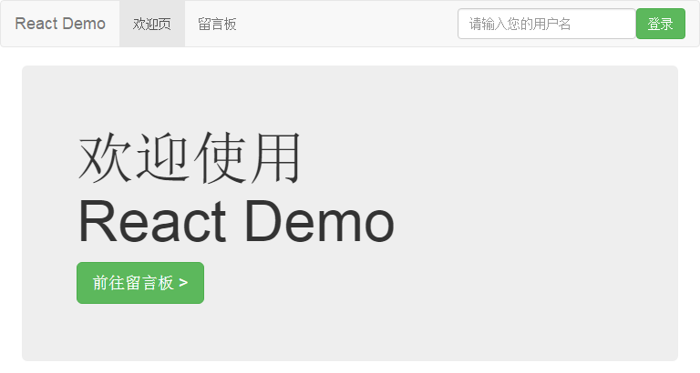

# React 示例项目 · 简易留言板 + 待办事项



> ###写在前面  
> 一直以来，我都相当纳闷：为什么 React 的那些 starter kit 都构建得那么恶心？  
> 能不能像 [Vue Cli][vue-cli] 生成的[项目架构][vue-cli-template]般优雅？说干就干，本项目就改自 [Vue Demo][vue-demo]
> 
> ### 更新
> 2016/8/28 &nbsp; 引入 `cross-env` 解决跨平台问题，新增优化项 `DedupePlugin`  
> 2016/8/29 &nbsp; 重命名 `makeContainer / makeReducer.js => createContainer / createReducer.js`  
> 2016/9/10 &nbsp; 重构 `src/redux/`

## 目录
#### &sect; [技术栈](#features)
#### &sect; [快速开始](#getting-started)
  * [安装](#installation)
  * [启动](#start)

#### &sect; [项目架构](#architecture)
  * [目录结构](#tree)
  * [特色](#character)

#### &sect; [开发](#development)
  * [Webpack 配置](#webpack-configure)
  * [规范](#standard)
  * [性能](#performance)
  
#### &sect; [测试](#testing)  
#### &sect; [部署](#deployment)
#### &sect; [参考](#reference)

****

## <a name="features">&sect; 技术栈</a>
> 详情可参阅 `package.json`

* React 15.3.0
* Redux
* React Router
* Ajax 请求库（Superagent / jQuery-Ajax / ...）
* Webpack
* ES6 + Babel
* jQuery + BootStrap (UI)

***

## <a name="getting-started">&sect; 快速开始</a>
在开始前，希望您已通读如下资料

* [React 文档][react-doc]
* [Redux 文档][redux-doc]（看完后懵逼的请转看 [Redux 莞式教程][simple-tutorial]）
* [React Router 文档][react-router-doc]

同时您还需要熟悉 ES6。例如，请把如下代码  
`const foo = ({ hello: { world: bar } }) => ({ bar })`  
转译成 ES5（答案请自行到 [Babel REPL][babel-repl] 在线编译验证）

### <a name="installation">⊙ 安装</a>
> 建议升级到 node 5.x/6.x + npm 3.x 环境  
> 推荐使用 `cnpm` 或手动切换到淘宝 npm 源  
> `npm set registry https://registry.npm.taobao.org/`

本示例项目需要结合 [简易留言板 RESTful API](https://github.com/kenberkeley/msg-board-api)  
模拟前后端分离开发（还为了与 [Vue Demo][vue-demo] 共用）  
请分别 `git clone`，打开**两个**命令窗口（ Windows 下推荐使用 `Cygwin`）**分别**切换到两者的目录下  
分别敲下 `npm install` 安装依赖（为避免 Windows 下的 npm 软链接问题，可加上 `--no-bin-link` 完全解构所有依赖）

> 虽然我们已经切换到了淘宝 npm 源，但安装 `node-sass@3.8.0` 的时候还是很有可能卡住  
> 因为它的安装需要从 Github 的 AWS 服务器拉取二进制文件，因此您可以为它指定源：  
> `npm i node-sass@3.8.0 --registry=https://registry.npm.taobao.org`
> 
> 如果您想简单粗暴一点，[这里](http://pan.baidu.com/s/1o8eu4t0)还提供了 `node_modules.zip`，直接解压即可

最后需要全局安装跨平台环境配置器：`npm i cross-env -g`

### <a name="start">⊙ 启动</a>
先后在 `msg-board-api`、`react-demo` 的命令窗口下，敲下 `npm start`  
如无意外，默认浏览器就会自动打开 `localhost:9090`，您立即可以看到效果  
若浏览器没有自动弹出，则请自行手动访问  
> 开发过程中，通过 Webpack 处理的静态资源都由基于内存的 `webpack-dev-server` 提供  
> P.S. 如果您还不清楚如何安装与启动，请看这个 [issue][how-to-start]

***

## <a name="architecture">&sect; 项目架构</a>
### <a name="tree">⊙ 目录结构</a>
```
.
├─ build/            # Webpack 配置目录
├─ dist/             # build 生成的生产环境下的项目
├─ src/              # 源码目录（开发都在这里进行）
│   ├─ components/     # 组件（COMPONENT）
│   ├─ redux/          # Redux 一箩筐
│   │   ├─ actions/      # （ACTION）
│   │   ├─ reducers/     # （REDUCER）
│   │   ├─ store/        # （STORE）
│   ├── routes/        # 路由（ROUTE）
│   ├── services/      # 服务（SERVICE，用于统一管理 XHR 请求，这是从 Vue Demo 中直接复制过来的）
│   ├── utils/         # 工具库（UTIL）
│   │   ├─ HoC/          # 高阶组件（HOC，全称 Higher Order Component）
│   │   ├─ mixins/       # 混合（MIXIN）
│   ├── views/         # 路由视图基页（VIEW）
│   │   ├─ layout/       # 全局布局
│   ├── app.js         # 启动文件
│   ├── index.html     # 静态基页
├── static/          # 放置无需经由 Webpack 处理的静态文件
├── .babelrc         # Babel 转码配置
├── .eslintignore    # （配置）ESLint 检查中需忽略的文件（夹）
├── .eslintrc        # ESLint 配置
├── .gitignore       # （配置）需被 Git 忽略的文件（夹）
├── package.json     # （这个就不用多解释了吧）
```

在这里您可能会问：怎么没有 `containers/` 目录？  
在本项目中，木偶组件与智能组件最大的差别在于：  
前者的状态是通过父组件传入获得，而后者是直接**连接**到 `state` 获得  
亦即：若一个木偶组件直接**连接**到 `state`，那么它就是一个所谓的智能组件  
（详见 [`src/utils/createContainer.js`][createContainer] 中对 `react-redux` 的 [`connect`][connect] 函数的封装）  
本示例项目唯一在组件的定义中自行使用 `connect` 函数的是 [`Navbar`][Navbar] 组件（且用到了 ES7 的装饰器）

有关木偶组件与智能组件更为精确的论述，推荐 Redux 作者 Dan 的[这篇文章][dan-post]，避免教条主义

> 您可以根据业务需求改动目录结构。若目录使用频繁，建议配置 [路径别名](#alias)  
> 默认的路径别名见上面目录结构注释中大写形式的常量

### <a name="character">⊙ 特色</a>
* 本示例项目秉承最佳实践，**高度洁癖**地实现代码分离/复用
* 优化目录结构，更好的模块分离，更接近 Vue 的开发模式
* Redux DevTools，可选 [Chrome 插件形式][chrome-extension]（默认） 或 内嵌页面的[组件形式][devtools-component]
* [Redux Logger][redux-logger] 打印动作及前后状态变化
* [why-did-you-update][why-did-u-update] 检测不必要的组件重渲染（默认关闭）
* 引入服务层统一管理 XHR 请求（好处请参考 Vue Demo 中的 [引入服务层][service-intro]）
* 引入 [路径别名](#alias) 实现优雅的加载模式
* 引入 [React Hot Reload][hot-loader]，支持热替换
* 生产环境下的编译对代码进行[优化][react-optimize]
* 迄今为止我见过的最完美的 starter kit

> 有关 Redux DevTools 与 why-did-you-update 的启用与禁用，见下面的 [开发环境全局变量](#dev-global-vars) 配置

***

## <a name="development">&sect; 开发</a>
### <a name="webpack-configure">⊙ Webpack 配置</a>
> 由于已经拥有相对成熟的 Webpack 配置，因此在一定程度上您可以不求甚解，但了解其配置会更能把握整体开发  

* 前端开发服务器为 `localhost:9090`，可在 `build/webpack.config.dev.js` 中找到
> 后端 RESTful API 基地址写在了 `src/services/xhr/config.js` 中，请根据实际自行修改

* 框架 / 类库 须分离打包以加快开发时的编译速度并有利于缓存，详见 `build/webpack.base.conf.js` 中的 `vendor`

* <a name="alias">**路径别名**</a> 的定义位于 `build/webpack.base.conf.js`，好处就是**引入与重构都很方便**
> 例如，在某组件中，引入 `userService` 需要 `import userService from '../../../services/userService'`  
> 但有了路径别名后，只需要 `import userService from 'SERVICE/userService'`  
> 相比于 AngularJS 中的依赖注入，这种方式依赖于构建工具，显得更为简单  
> 
> 您可能会说，Webpack 只需要设定了 `root`属性为 `src/`  
> 就可以 `import userService from 'services/userService'`  
> 但在这里其实是会引起歧义的（不过这属于强迫症的范畴。。。）  
> 例如，`import createBrowserHistory from 'history/lib/createBrowserHistory'`  
> 您可能会觉得这是 `src/history/lib/createBrowserHistory.js`  
> 但实际上 [history][history] 是一个 npm package  
> 同样地，您又怎么知道 `services` 不是一个 npm package？  
> 而且重构之后，文件夹的变动会导致相对路径的变化，`services/` 目录未必仍在 `src/` 下    
> 因此，路径别名相当有必要。其**常量**的形式，让人一看就知道不是一个 npm package

* 开发环境<a name="dev-global-vars">**全局变量**</a>，由 `webpack.DefinePlugin` 提供（详见 `build/webpack.base.conf.js`）
> 默认有 `__DEV__` / `__PROD__` / `__COMPONENT_DEVTOOLS__` / `__WHY_DID_YOU_UPDATE__` 四个全局变量  
> 若要继续添加，则还需要在 `.eslintrc` 中 `globals` 同步写入
> 
> 在此需要提醒，在 `package.json` 中设置 `NODE_ENV` 要注意末尾空格的[问题](http://stackoverflow.com/questions/11104028/#38948727)  
> 最好就是使用前 `trim` 一下：`process.env.NODE_ENV.trim()`
> 
> 拓展阅读：[解读 UglifyJS](http://rapheal.sinaapp.com/tag/uglifyjs/)  
> 看看生产环境下编译 `if (__PROD__) { ... }` => `if (true) { ... }` 后 [UglifyJS](http://rapheal.sinaapp.com/2014/05/22/uglifyjs-squeeze/) 会如何处理


### <a name="standard">⊙ 规范</a>
> 本示例项目的代码极尽详细地添加了注释，其中不乏最佳实践提示

为了减少代码量，我省去了 [Prop 验证][proptypes]，建议您在往后的开发中使用

### <a name="performance">⊙ 性能</a>
大概可参阅如下文章：

* React 文档 · [Advanced Performance](https://facebook.github.io/react/docs/advanced-performance.html)
* 反鸡汤 · [Should I use shouldComponentUpdate](http://jamesknelson.com/should-i-use-shouldcomponentupdate/)（[译文](http://www.infoq.com/cn/news/2016/07/react-shouldComponentUpdate)）
* 淘宝 FED · [高性能 React 组件](http://taobaofed.org/blog/2016/08/12/optimized-react-components/)
* 腾讯 Dev Club · [React 移动 Web 极致优化](http://dev.qq.com/topic/579083d1c9da73584b02587d)

***

## <a name="testing">&sect; 测试</a>
> 请自行选择测试工具

***

## <a name="deployment">&sect; 部署</a>
在 `react-demo` 的命令窗口下，敲下 `npm run build`，将会在项目根目录下生成 `dist/`  
> 您可以使用命令行静态资源服务器 [serve](https://github.com/tj/serve) ( `npm i serve -g` )，敲下 `serve -p [端口] dist` 来快速查看 build 后的项目  
> 还可以 `cd dist` 后，`python -m SimpleHTTPServer [端口]` 或 `php -S localhost:[端口]` 快速便捷地实现静态资源服务器
>
> 关于生产环境下的部署与优化，已超出本文档的论述范围，请自行查阅相关资料  

***

## <a name="reference">&sect; 参考</a>
* [Vue Demo][vue-demo]
* [davezuko/react-redux-starter-kit](https://github.com/davezuko/react-redux-starter-kit)
* [探讨 React 项目目录结构](http://marmelab.com/blog/2015/12/17/react-directory-structure.html)

[vue-cli]: https://github.com/vuejs/vue-cli
[vue-cli-template]: http://vuejs-templates.github.io/webpack/structure
[vue-demo]: https://github.com/kenberkeley/vue-demo
[react-doc]: http://reactjs.cn/react/docs/getting-started-zh-CN.html
[redux-doc]: http://camsong.github.io/redux-in-chinese/index.html
[simple-tutorial]: https://github.com/kenberkeley/redux-simple-tutorial
[react-router-doc]: http://react-guide.github.io/react-router-cn/
[babel-repl]: http://babeljs.io/repl/
[how-to-start]: https://github.com/kenberkeley/react-demo/issues/1
[service-intro]: https://github.com/kenberkeley/vue-demo#service-layer
[alias-intro]: https://github.com/kenberkeley/vue-demo#alias
[createContainer]: https://github.com/kenberkeley/react-demo/blob/master/src/utils/createContainer.js
[Navbar]: https://github.com/kenberkeley/react-demo/blob/master/src/components/Navbar/index.js
[connect]: https://github.com/reactjs/react-redux/blob/master/docs/api.md#connectmapstatetoprops-mapdispatchtoprops-mergeprops-options
[dan-post]: https://medium.com/@dan_abramov/smart-and-dumb-components-7ca2f9a7c7d0
[chrome-extension]: https://github.com/zalmoxisus/redux-devtools-extension
[devtools-component]: https://github.com/gaearon/redux-devtools
[redux-logger]: https://github.com/evgenyrodionov/redux-logger
[why-did-u-update]: https://github.com/garbles/why-did-you-update
[hot-loader]: https://github.com/gaearon/react-hot-loader
[react-optimize]: https://github.com/thejameskyle/babel-react-optimize
[history]: https://github.com/ReactTraining/history
[proptypes]: https://facebook.github.io/react/docs/reusable-components-zh-CN.html#prop-验证
